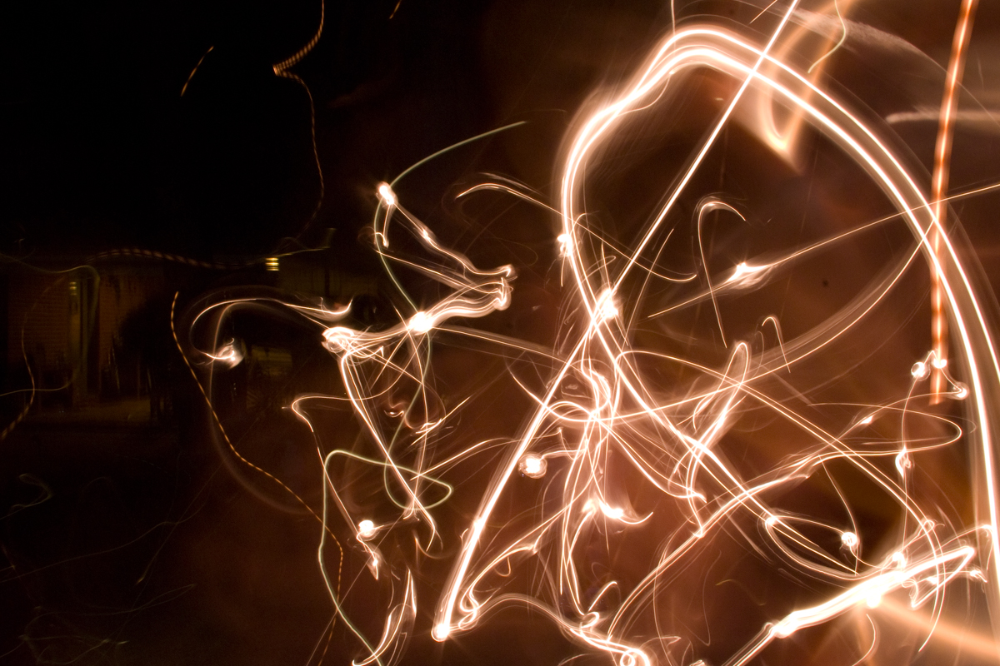
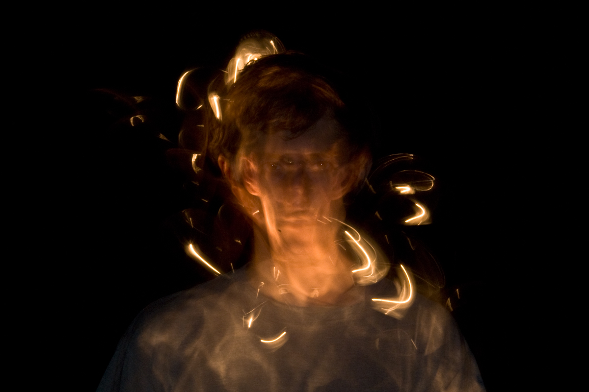

<figure className="lg:-ml-24 xl:-ml-32 lg:-mr-24 xl:-mr-32">
  
</figure>

Experiments in high-speed photography with [@lejeunerenard](https://twitter.com/lejeunerenard). A visual exploration of John Donne's [Holy Sonnet](https://www.poetryfoundation.org/poems/44108/holy-sonnets-i-am-a-little-world-made-cunningly). A representation of the power of the elements to purify and renew through destruction.

> I am a little world made cunningly 
> Of elements and an angelic sprite

> But black sin hath betray'd to endless night 
> My world's both parts, and oh both parts must die.

> Pour new seas in mine eyes, that so I might 
> Drown my world with my weeping earnestly

> But oh it must be burnt; alas the fire 
> Of lust and envy have burnt it heretofore 
> And made it fouler

> Let their flames retire, 
> And burn me O Lord, with a fiery zeal 
> Of thee and thy house, which doth in eating heal.

