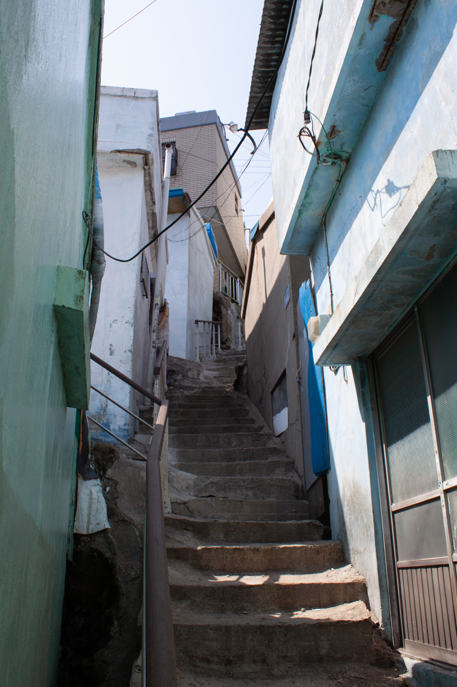
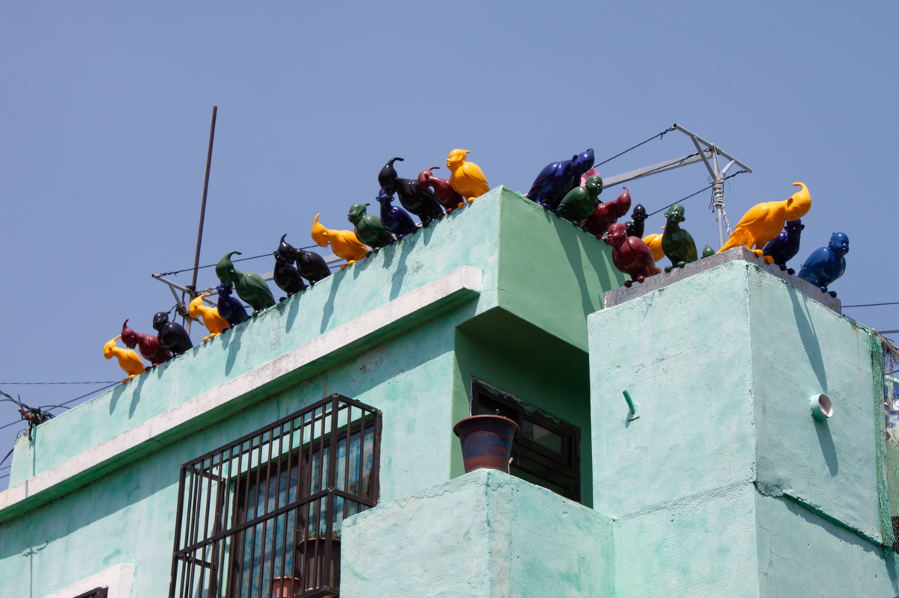
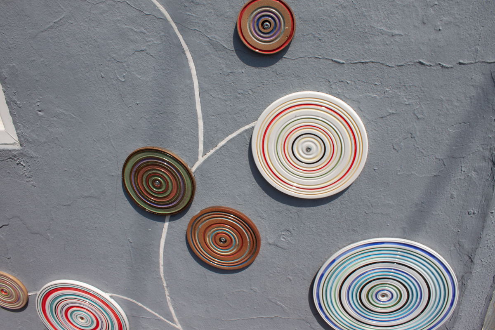
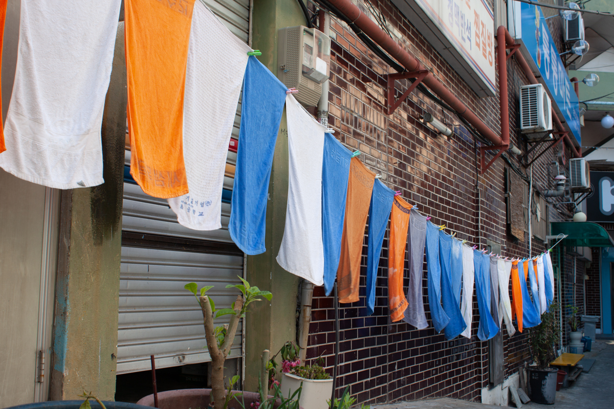
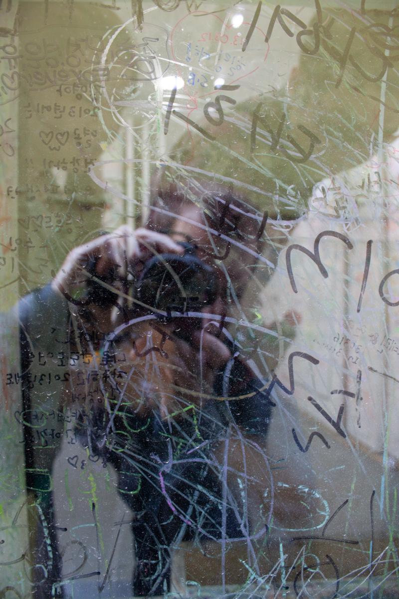

A town where everything is made of color, 
Even the rust of metal roofs—gold dust over indigo. 
Plastic bird people sit perched, leaning over the eaves, 
Watching the tourists with insensible smiles.

