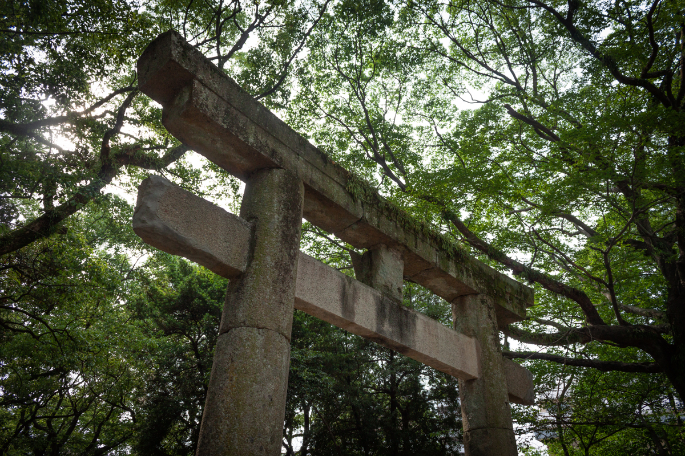
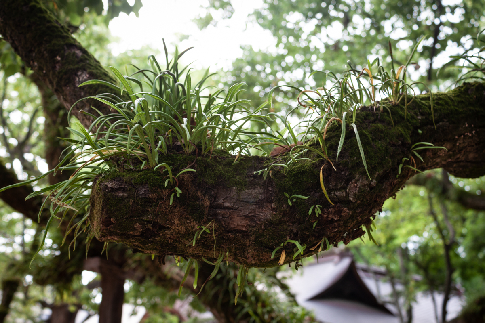
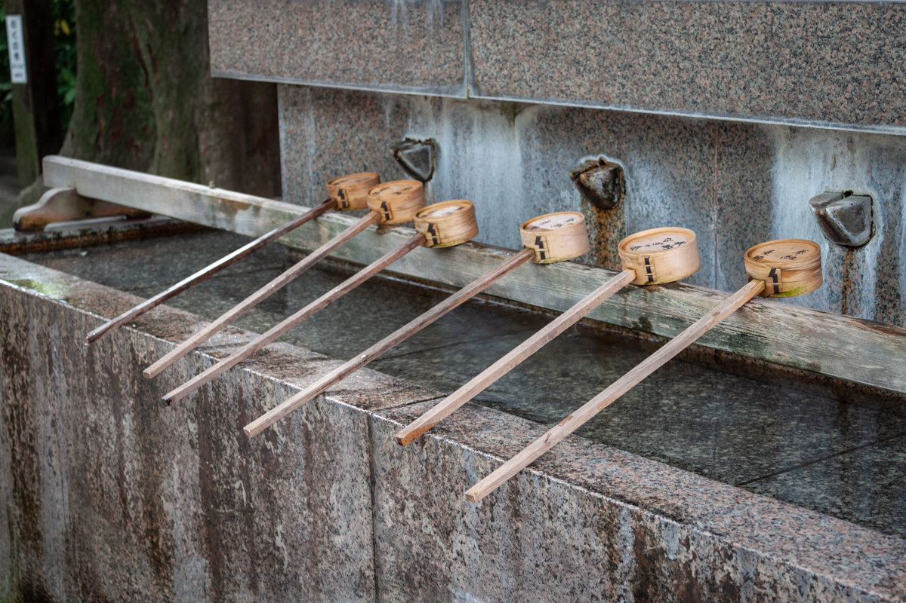
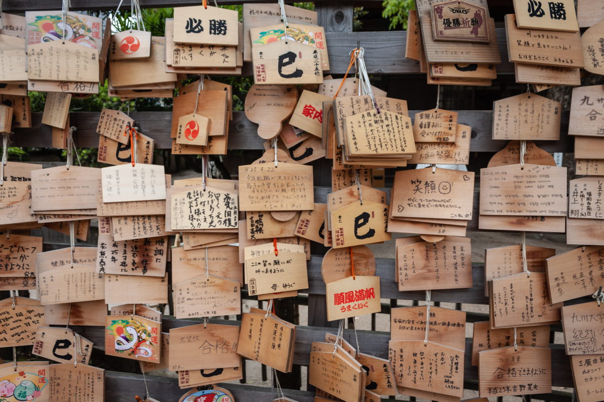
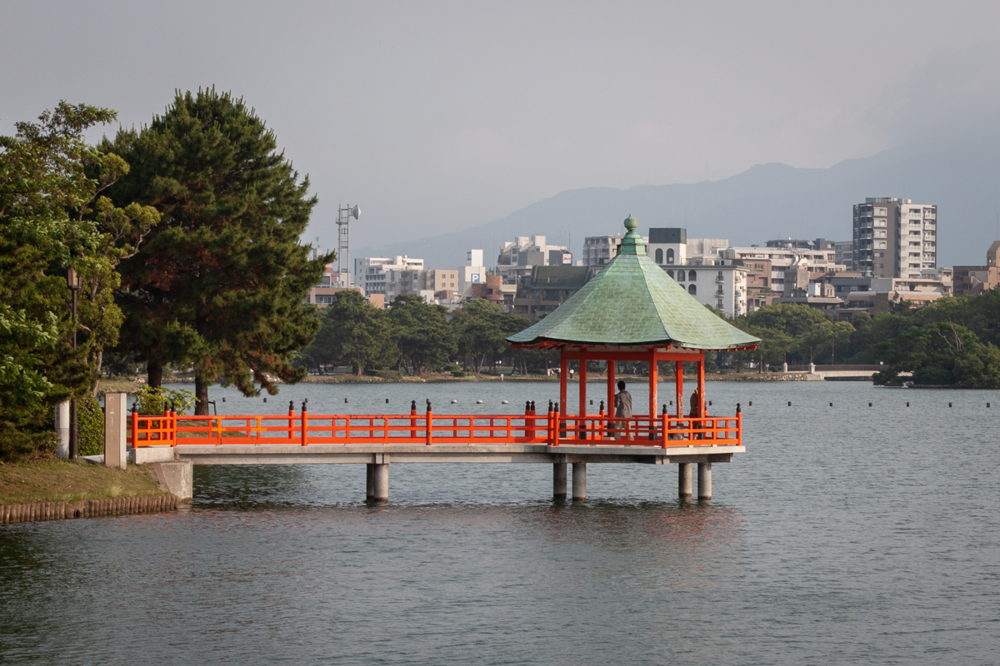
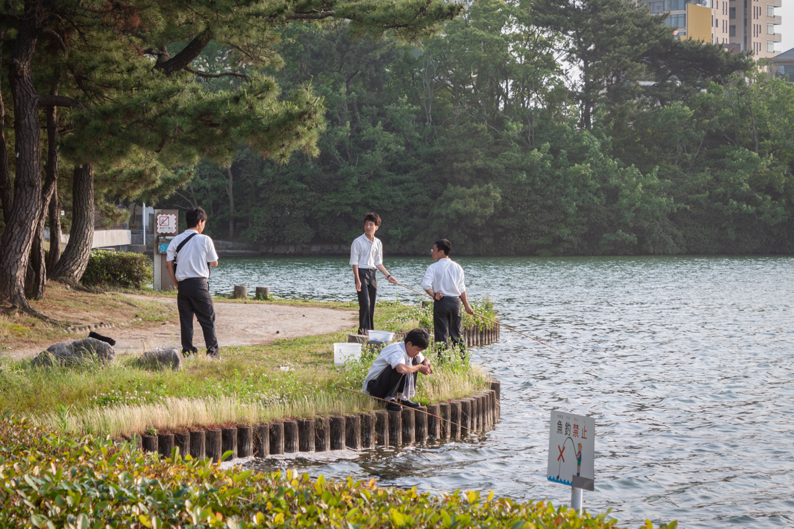
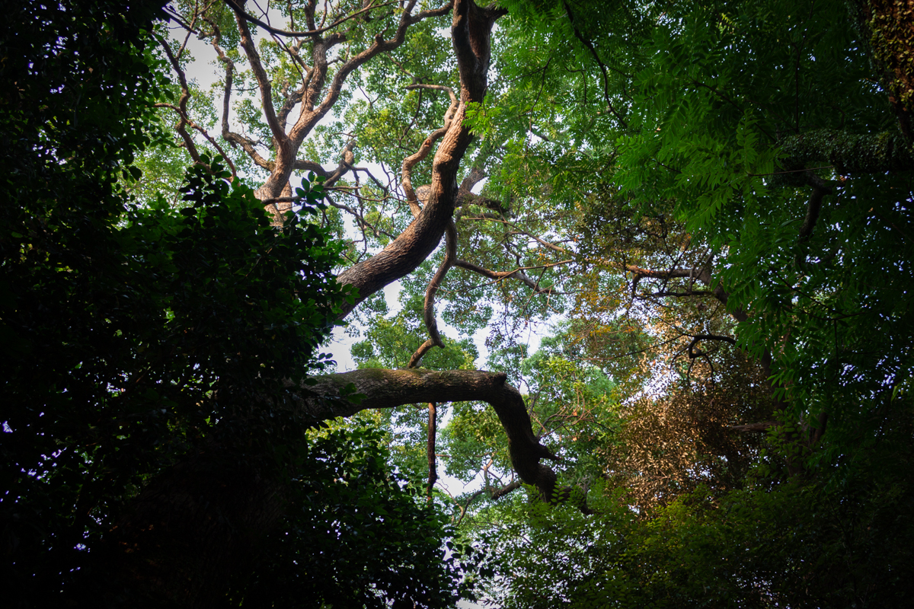
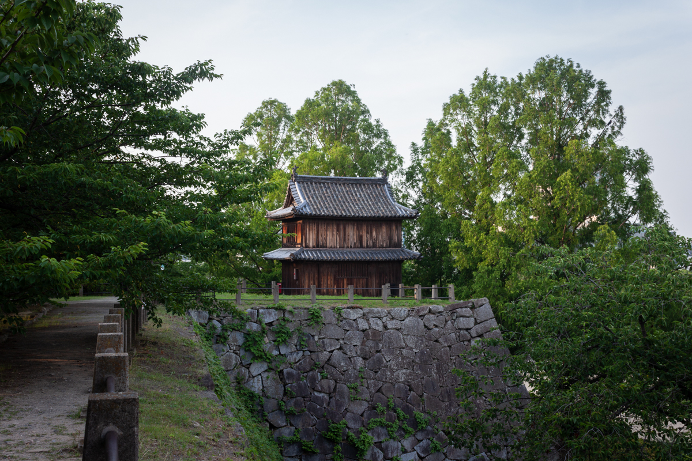
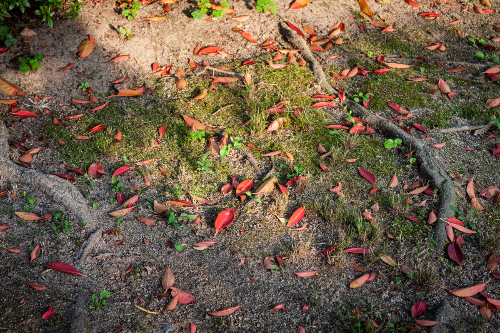
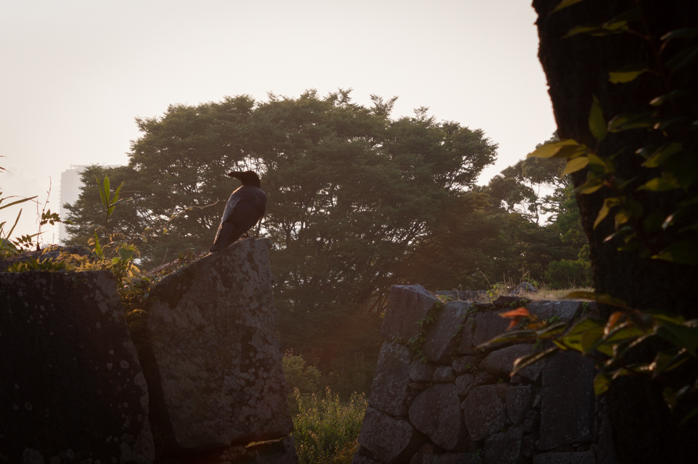

Once, in Fukuoka, I saw a place where water is served from bamboo ladles, where prayers are left on tablets of wood.

I saw high school boys in crisp white shirts, fishing in the river.

Great trees reached skyward in the park, and the evening sun shone through the leaves.

