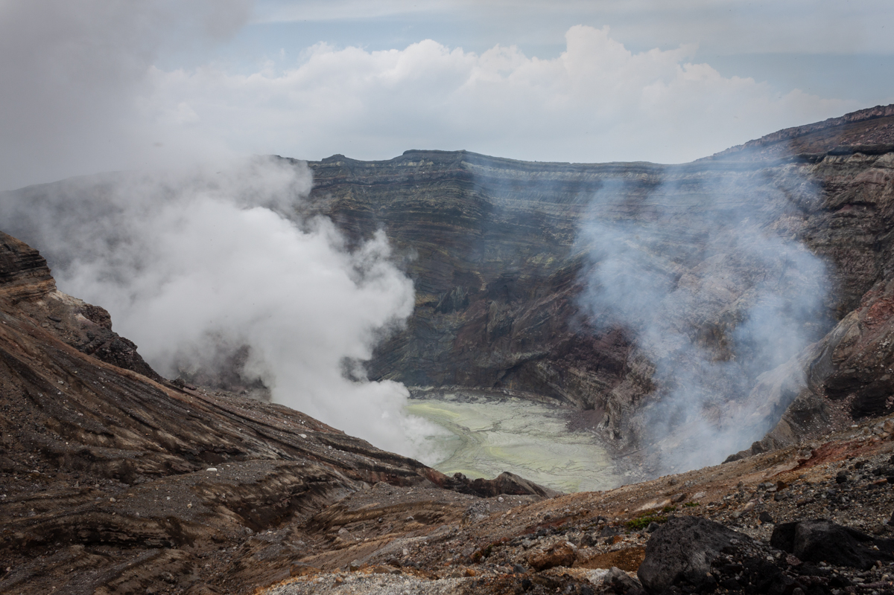
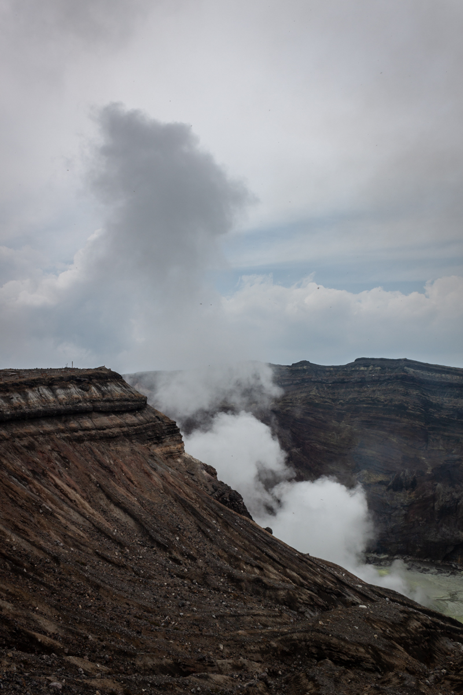
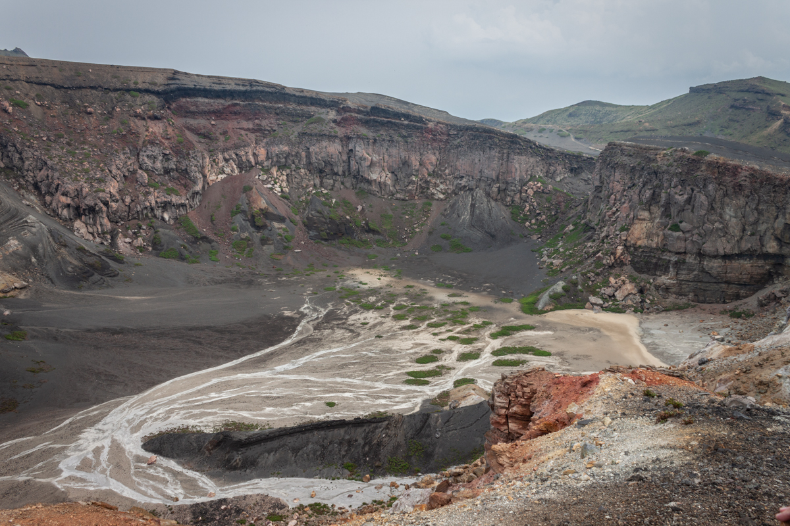
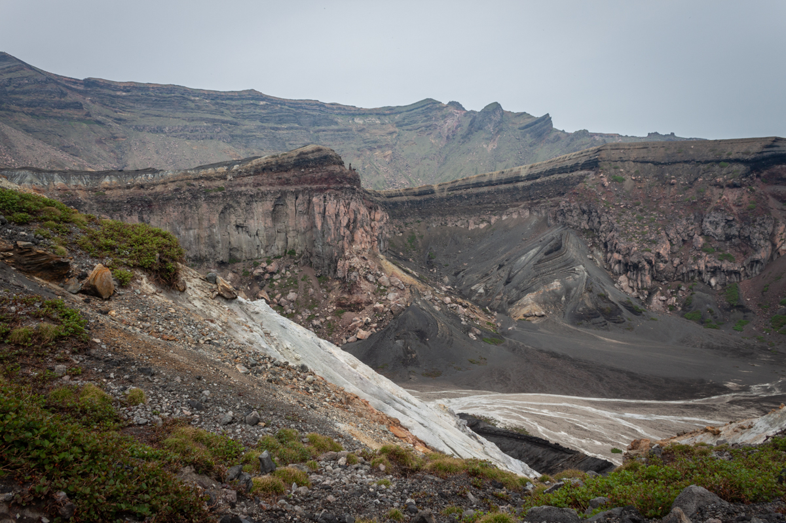
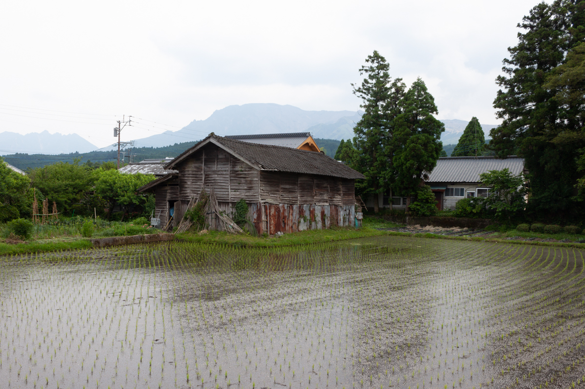

Noxious fumes rise from a green pool, 
At the heart of Mount Aso. 
Pinpoint bugs bite my arms, my neck.

I see land that was vomited, spewed, and spattered.

Still people make a home there, 
Growing rice in the shadow of the mountain.

