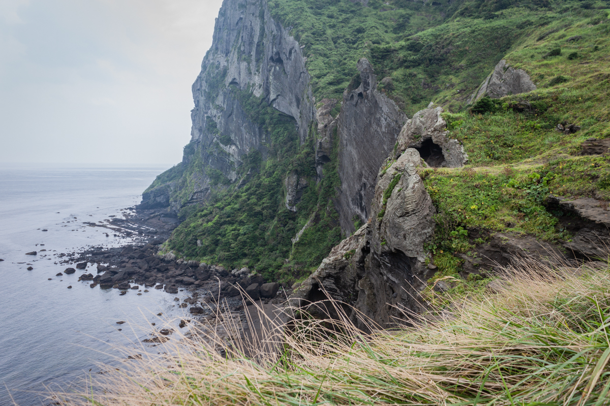
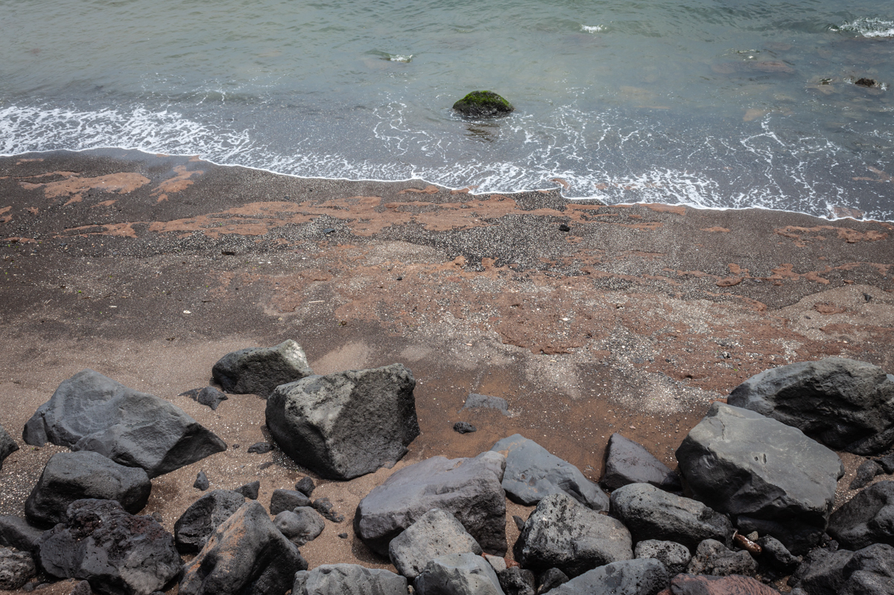
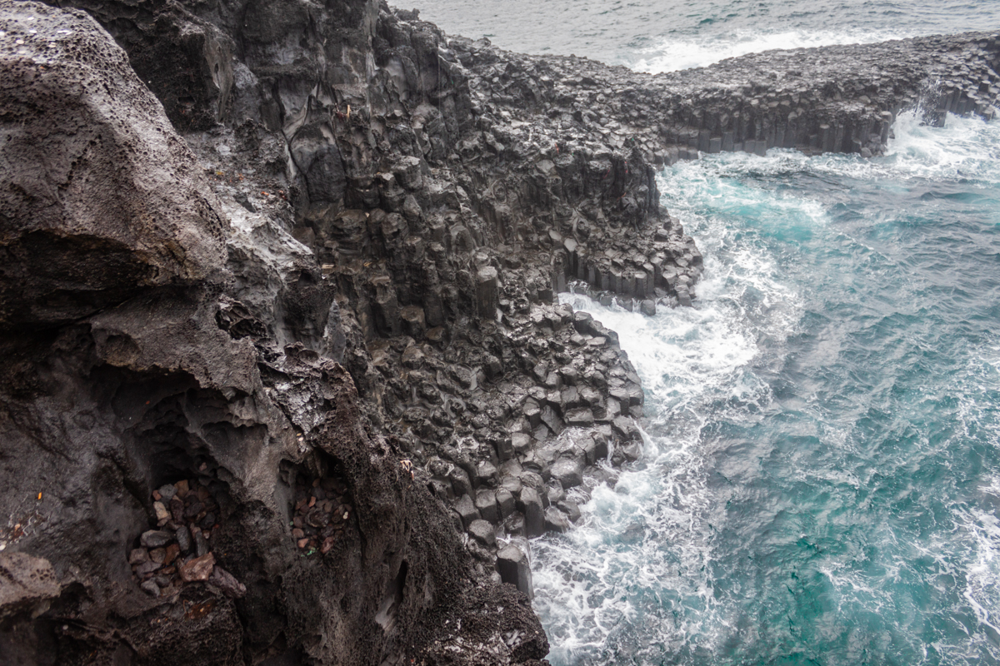
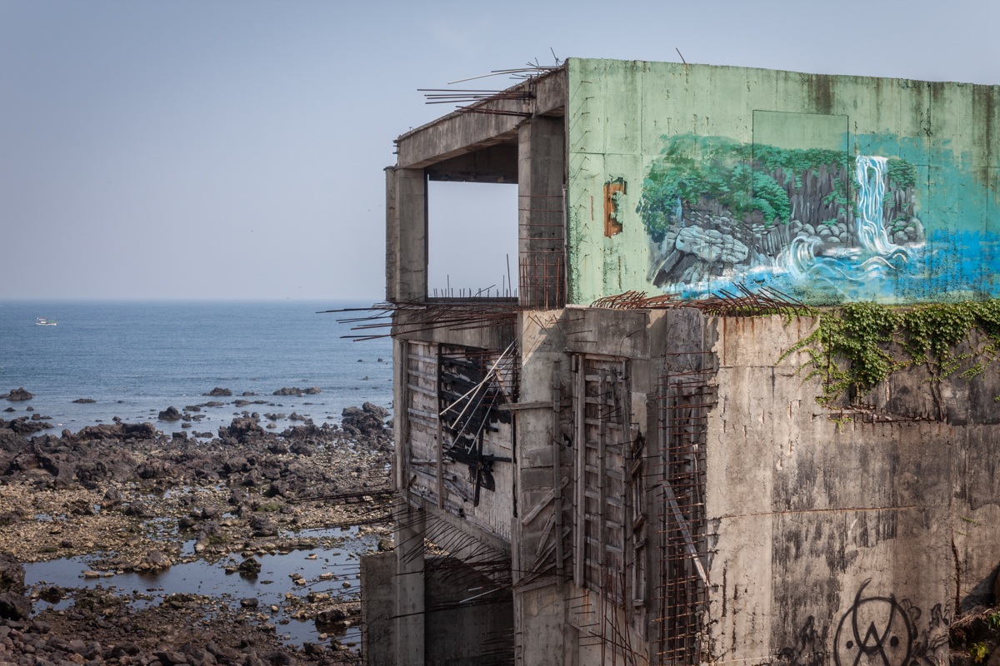
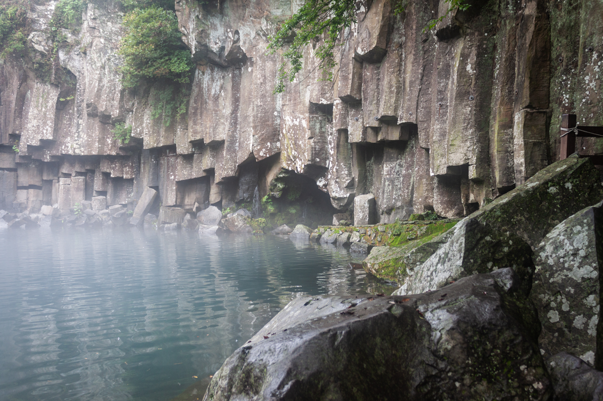

Alone on Jeju Island, climbing the grassy slopes of Sunrise Peak.

Looking for the holy dragon beneath Jeongbang Falls.

Hexagonal memories of when Mount Halla was young at the cliffs of Jusangjeolli.

A visit to God's Pond, heavy with mist and the weight of an older world.

