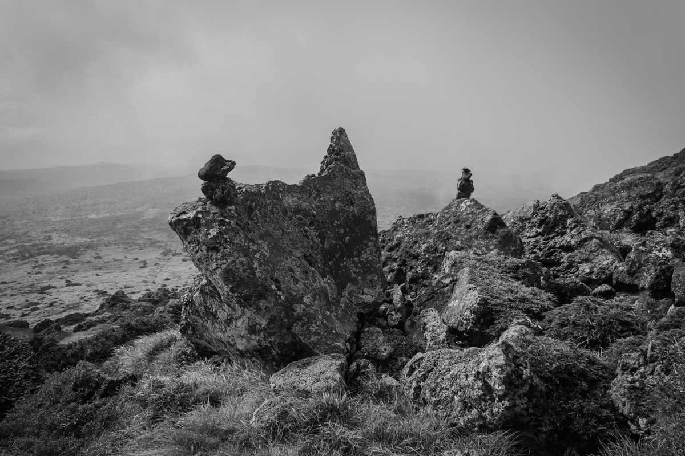
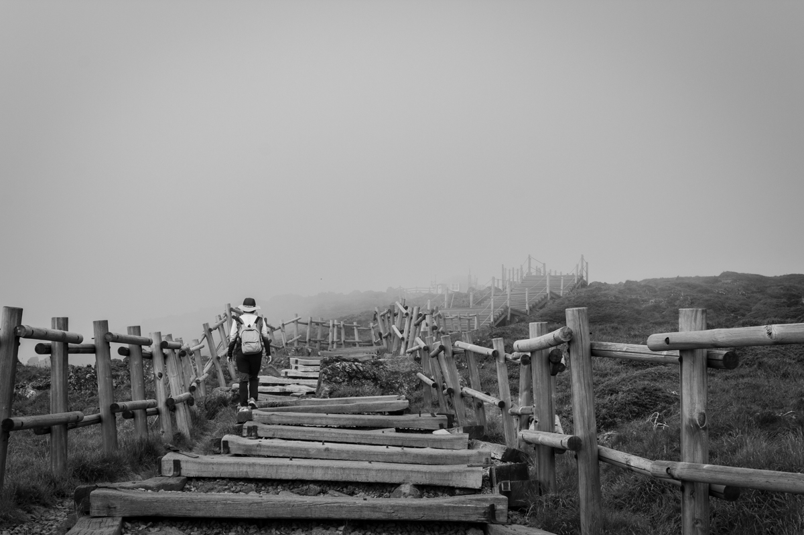
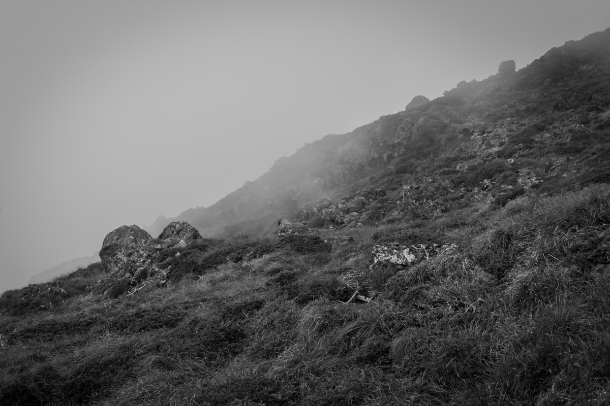
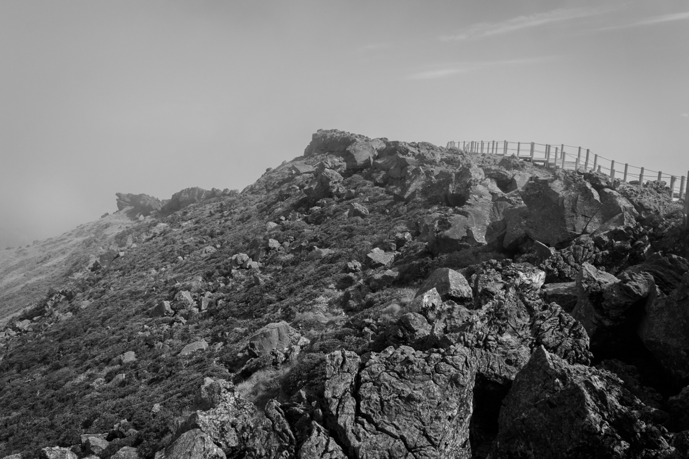
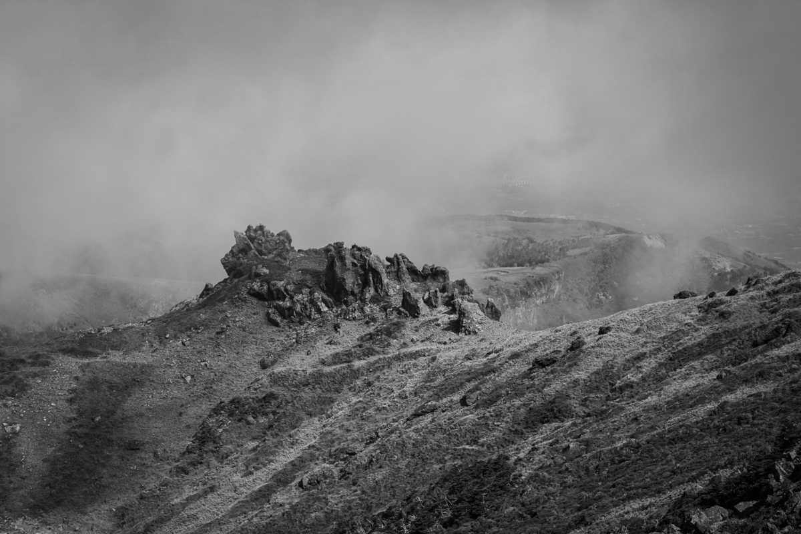

Mist clings to the side of Mount Halla, 
I walk up and away, into the nothingness. 
Until, for a moment, a wind blows, 
And I see a ridge, a valley, a lake. 
Then the air changes, the mist returns, 
And I am alone again, 
Blind to whatever lies a little way ahead.

