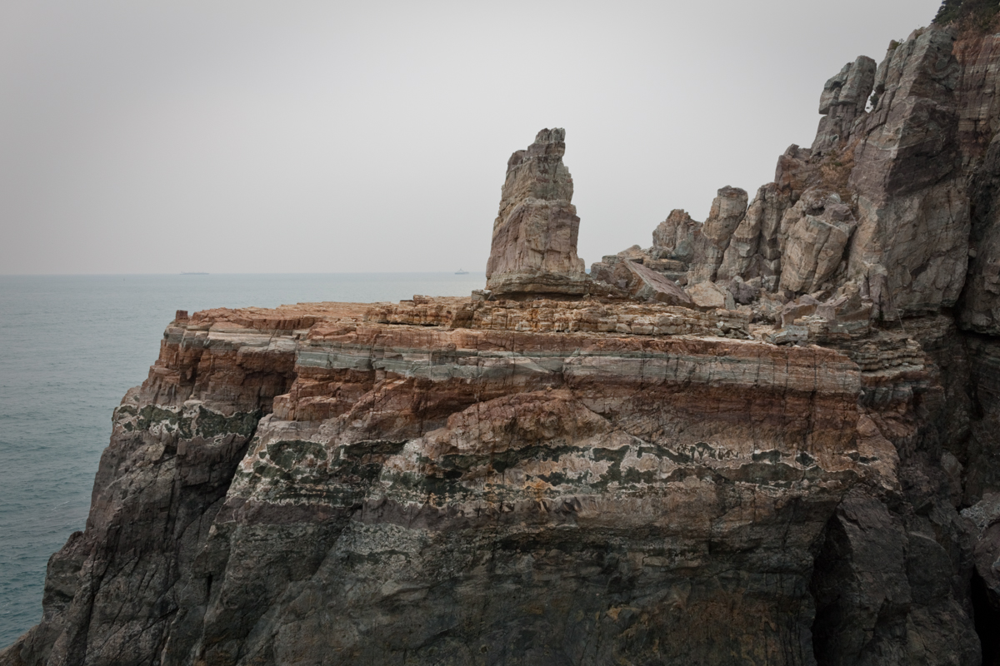
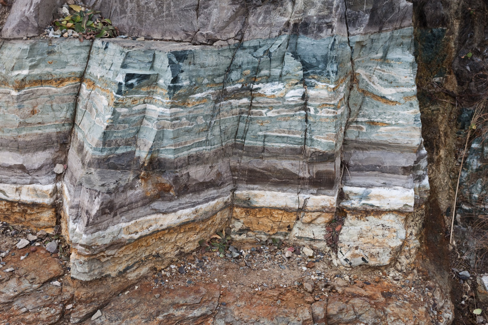
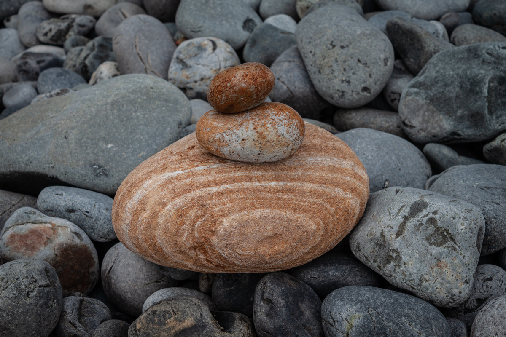
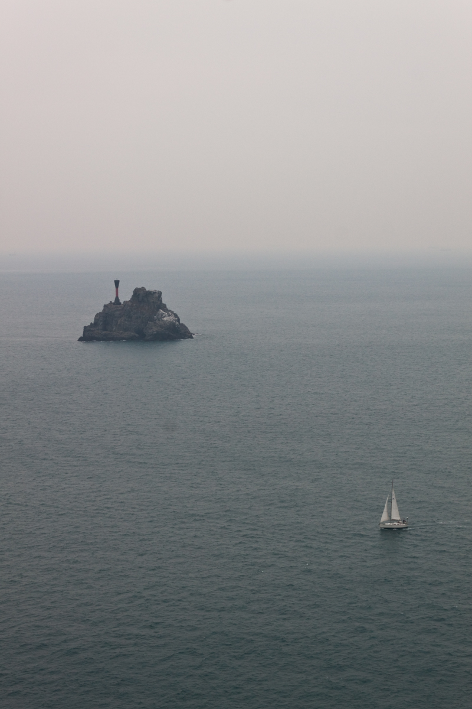
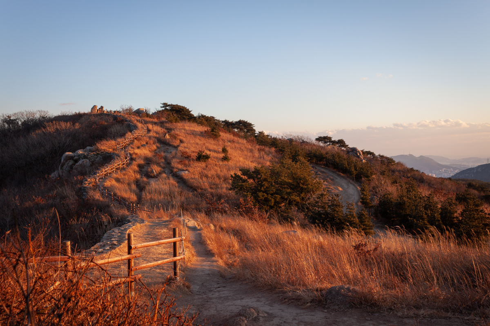
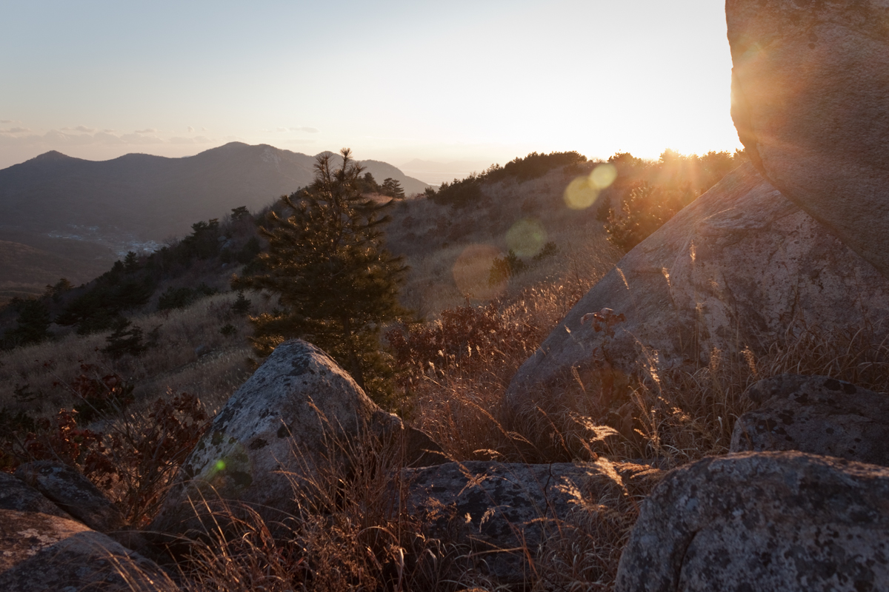
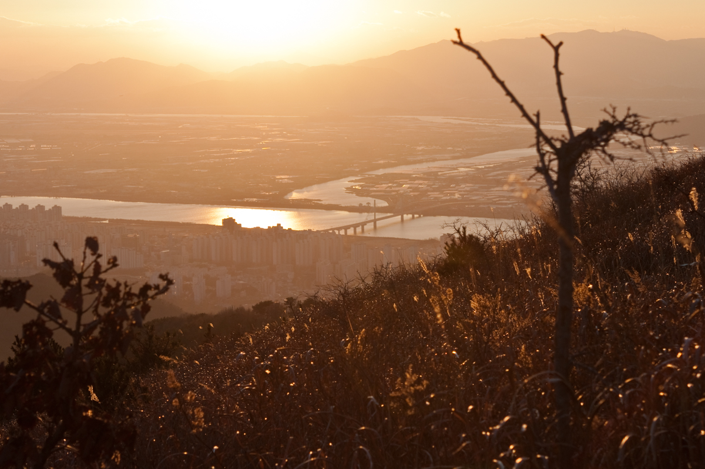
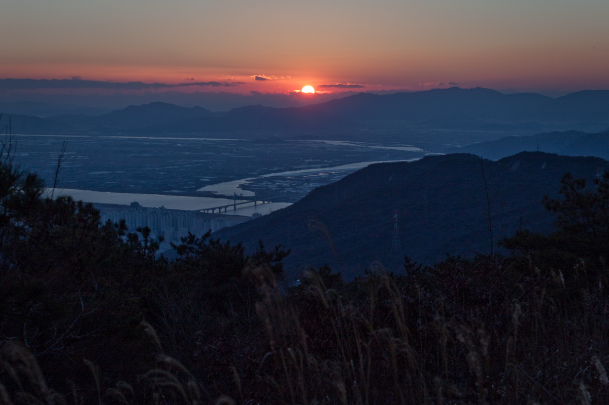
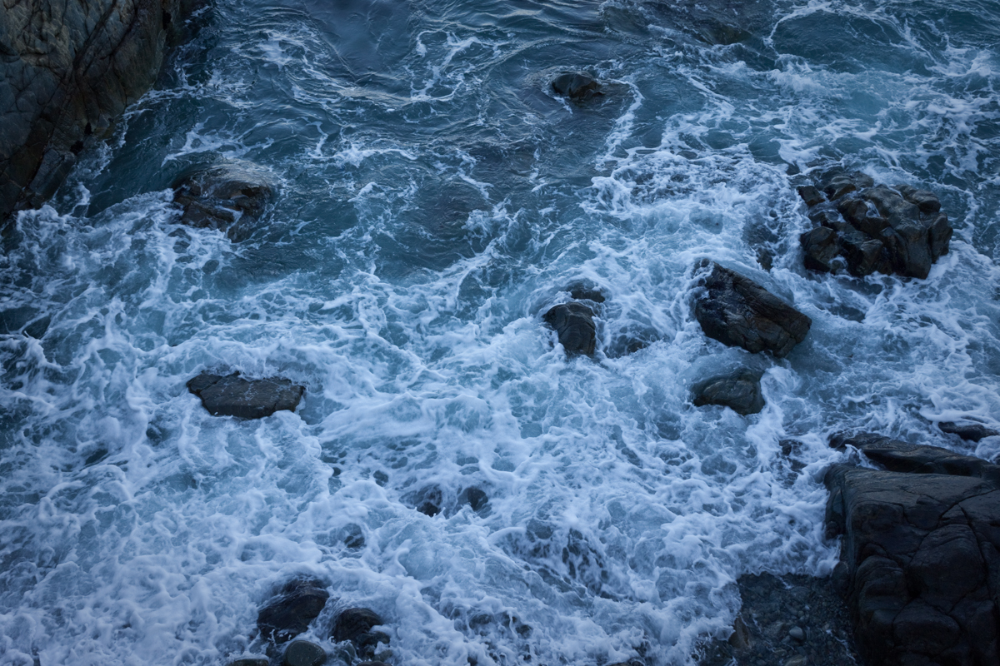
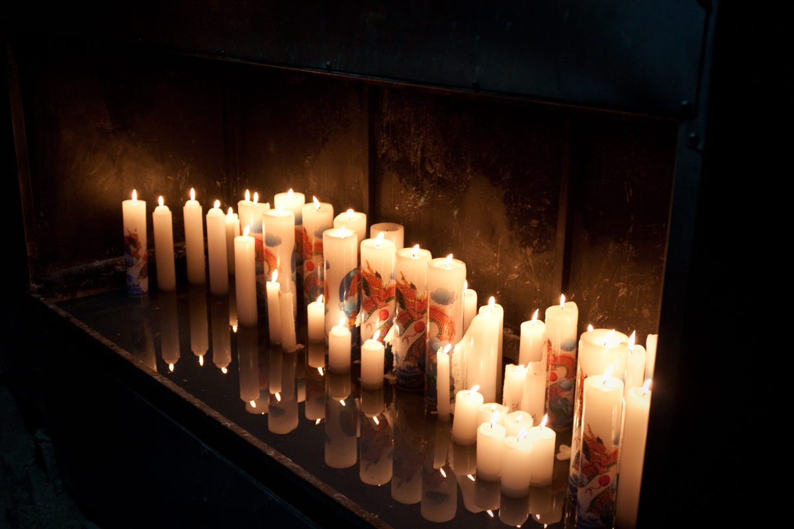

Winter runs through the stones at Taejongdae, 
Chilling the strata, turning them blue.

There is sunfire on the heights of Mount Geumjeong. 
The last of the year, before the chill comes, 
And the world falls into darkness.

Cold winds blow over the sea, 
Cold waves crash over the rocks, 
And candlelight is all we have left.

