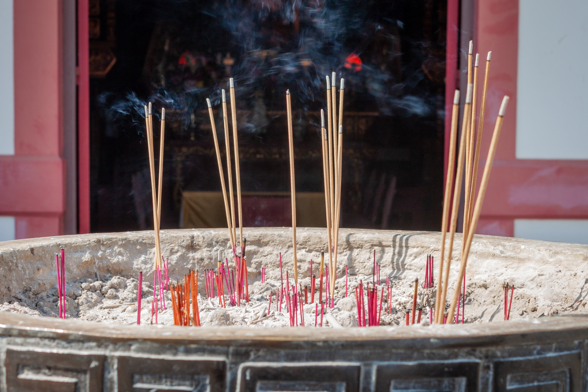
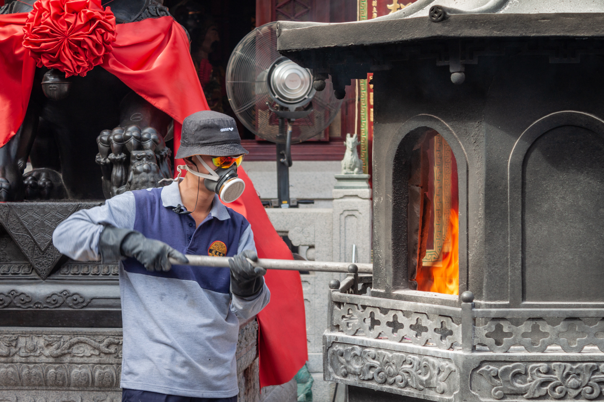
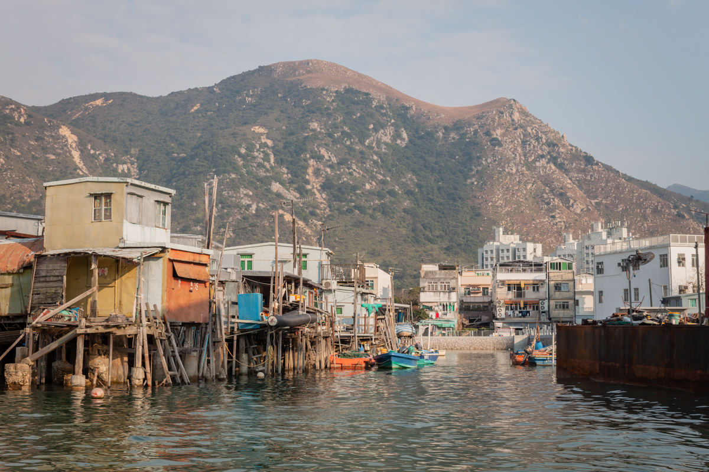

In Hong Kong, in manicured gardens, 
In parks where the middle-aged practice tai chi.

At temples where the incense is strong, 
Where prayers float up like smoke.

There are fishing villages built on stilts, 
A beautiful chaos of plastics and rusted metal.

And a cable car that carries us over the mountains, 
Under the dying light of a hazy sun.

